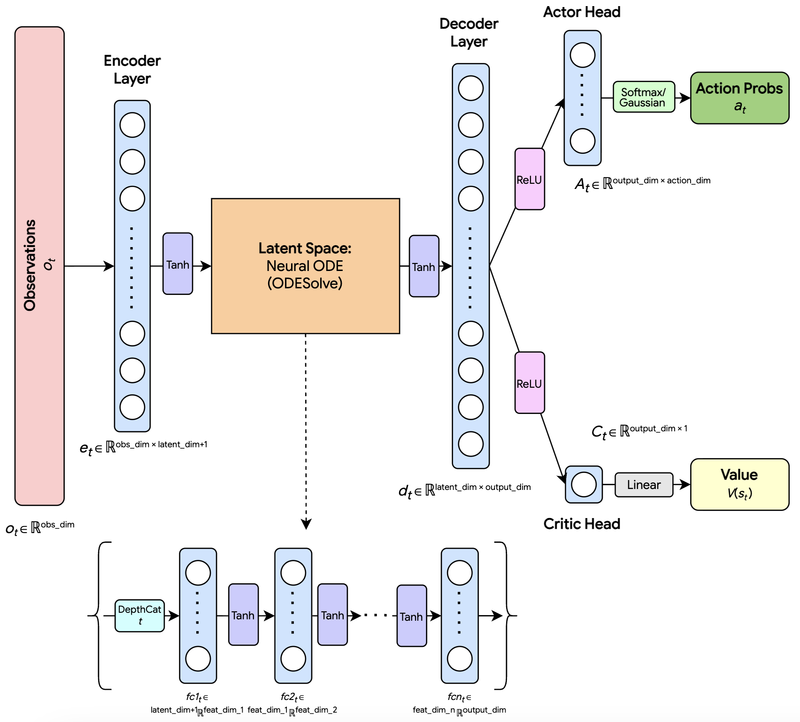

# Continuum: A Dimension-Agnostic Neural ODE Deep Reinforcement Learning Framework for Physics-Based Environments
[[Project Page]](https://kseto06.github.io/Continuum/) | [[Paper]]()

<p align="center">
    
</p>

**Kaden Seto**<sup>1</sup>, **Ryan Qian**<sup>1</sup>, **Kane Pan**<sup>1</sup>

<sup>1</sup>University of Toronto

In this work, we propose **Continuum**, a deep RL framework and neural network architecture for physics-informed reinforcement learning. The architecture combines NODEs, Autoencoders, and model-free RL algorithms, where the latent space of the Autoencoder is represented by a time-dependent NODE that learns the continuous-time dynamics of the environment. In this architecture, we aim to build a neural network that has stronger physics alignment and interpretability, thus encouraging policies to make predictions based on structured latent representations of the learned system dynamics that promote stability and performance.

---

## Installation, Setup and Usage

Follow the steps below to set up Continuum.

### Step 1: Clone the Repository
    
```sh
git clone https://github.com/kseto06/Continuum
```

### Step 2: Install Dependencies

1. Open a terminal and run the following set of commands to install necessary libraries and dependencies:

    Create a virtual environment:
    ```sh
    python -m venv venv
    ```

    If on macOS / Linux:
    ```sh
    source venv/bin/activate 
    ```

    If on Windows: 
    ```sh
    venv\Scripts\activate
    ```

    Install requirements:
    ```
    pip install -r requirements.txt
    ```

2. Once dependencies are installed, navigate to the correct directory:
    ```sh
    cd continuum
    ```

### Step 3: Run Training

Follow the instructions in `main.py` for setting up training:

1. Set the Gym/MuJoCo environment name out of the listed environments:
    ```python
    env_name = "<env_name>"
    ```

2. If resuming training from a checkpoint, **set the path** of the `.pkl` file from the training checkpoint in `rl-model`:
    ```python
    env = VecNormalize.load("<path>", env)
    ```

   Otherwise, use the given default `VecNormalize` arguments provided, i.e:
    ```python
    env = make_vec_env(env_name, n_envs=16, vec_env_cls=SubprocVecEnv)
    ```

3. **Optionally**, set the model architecture using PyTorch's `nn.Sequential` class, otherwise the network architecture will be defaulted for you. An example of an architecture:
    ```python
    latent_dim = 64
    features_dim = 128
    network_arch = nn.Sequential(
        DepthCat(1),
        nn.Linear(latent_dim + 1, features_dim),
        nn.Tanh(),
        LSTMOutputExtractor(input_size=features_dim, hidden_size=features_dim, num_layers=1, batch_first=True),
        nn.Tanh(),
        nn.Linear(features_dim, latent_dim)
    )
    ```

4. Ensure that the corresponding architecture uses the correct `Extractor` class. If the network architecture is:
- Standard MLP: use `MlpNodeExtractor`
- CNN: use `CnnNodeExtractor`
- LSTM: use `MlpLstmNodeExtractor`
    If the network architecture in Step 3 was defaulted, then the `Extractor` class used will be automatically defaulted as well. 

5. For running training, run this command in terminal with the expected arguments:
    ```sh
    python main.py <solver_name (str)> <total_timesteps (int)> <checkpoint_interval (int)>
    ```
    
### Step 4: Run Inference

In `runner.py`:
1. Set the Gym/MuJoCo environment name to run inference on:
    ```python
    env_name = "<env_name>"
    ```
2. Set the `.pkl` path and the model's path `.zip`:
    ```python
    vec_path = "<path_to_pkl>"
    model_path = "<path_to_model>"
    ```
3. Run the file in a terminal command:
    ```sh
    python runner.py
    ```